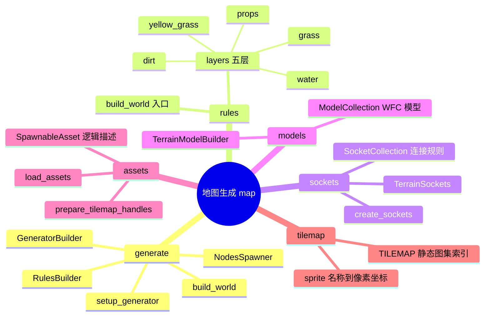
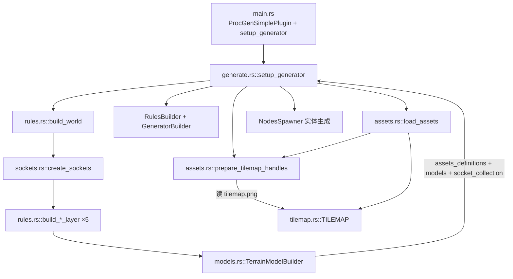
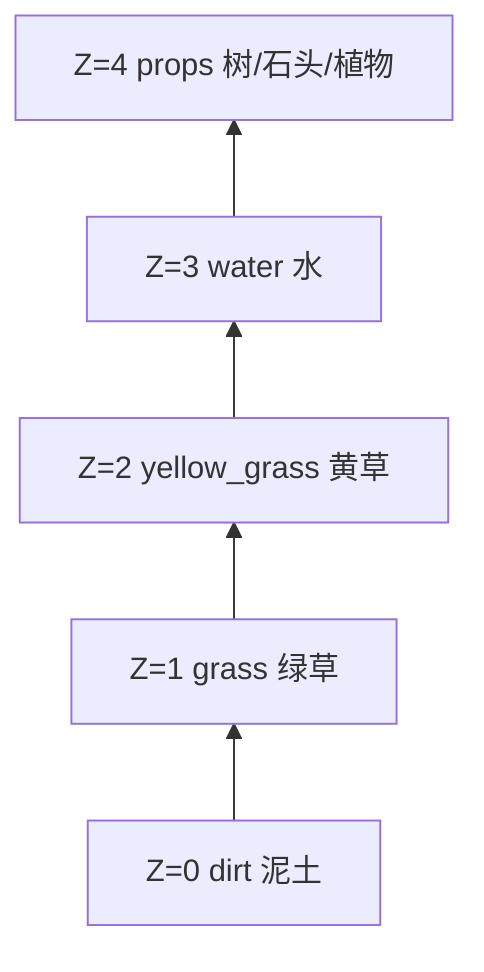
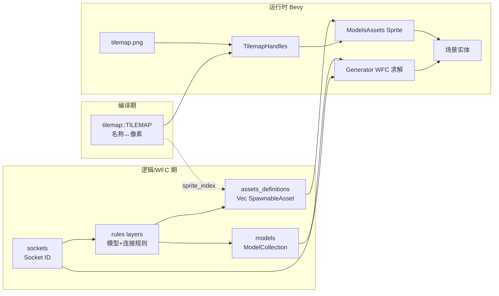
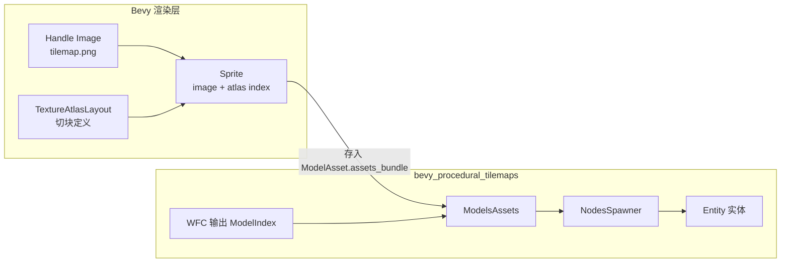
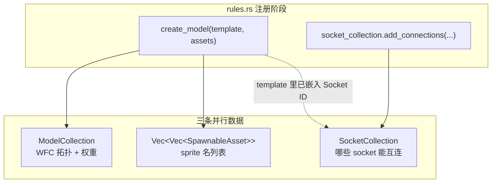

# 地图模块架构说明

本文档说明 `src/map` 下各模块的职责、关系与调用方式。工程使用 [bevy_procedural_tilemaps](https://crates.io/crates/bevy_procedural_tilemaps) 做 WFC（Wave Function Collapse）程序化地图生成。

若阅读时对图集加载、socket 命名、`create_model` 返回值、`load_assets` 下标等有疑问，可直接跳至文末 **[常见问题（阅读答疑）](#常见问题阅读答疑)**。
---

## 模块一览

| 文件 | 模块 | 职责 |
| --- | --- | --- |
| `generate.rs` | 生成入口 | 组装 WFC 规则、加载图集、生成实体 |
| `rules.rs` | 规则 + 层 | 定义五层地形的模型与 socket 连接 |
| `sockets.rs` | 插槽 | 创建 `TerrainSockets` 与 `SocketCollection` |
| `models.rs` | 模型构建器 | 同步 `ModelCollection` 与资源列表下标 |
| `assets.rs` | 运行时资源 | `SpawnableAsset`、图集加载、绑定 Sprite |
| `tilemap.rs` | 静态图集表 | `TILEMAP`：sprite 名称 → 像素坐标 |

---

## 总览思维导图



---

## 调用链（从启动到渲染）



核心入口在 `src/map/generate.rs` 的 `setup_generator`：

```rust
// 1. 规则初始化：瓦片定义 + 连接规则
let (assets_definitions, models, socket_collection) = build_world();

let rules = RulesBuilder::new_cartesian_3d(models, socket_collection)
    .with_rotation_axis(Direction::ZForward)
    .build()
    .unwrap();

// 2. 网格 + 3. WFC 算法配置
let grid = CartesianGrid::new_cartesian_3d(GRID_X, GRID_Y, GRID_Z, false, false, false);
let generator = GeneratorBuilder::new()
    .with_rules(rules)
    .with_grid(grid.clone())
    // ...
    .build()
    .unwrap();

// 4. 加载图集并绑定可渲染资源
let tilemap_handles =
    prepare_tilemap_handles(&asset_server, &mut atlas_layouts, ASSETS_PATH, TILEMAP_FILE);
let models_assets = load_assets(&tilemap_handles, assets_definitions);

// 5. 生成器实体 + NodesSpawner
commands.spawn((Transform::..., grid, generator, NodesSpawner::new(models_assets, ...)));
```

`main.rs` 通过 `ProcGenSimplePlugin` 与 `Startup` 系统 `setup_generator` 启动整条链路。

---

## 各模块职责与关系

### 1. `tilemap` — 静态图集字典（最底层、无依赖）

| 内容 | 作用 |
| --- | --- |
| `TILEMAP` 常量 | 32×32 瓦片、256×320 图集尺寸 |
| `TilemapSprite` | 每个 sprite 的 **名称** + 在 `tilemap.png` 里的像素坐标 |
| `sprite_index` / `sprite_rect` | 名称 → 图集索引 / UV 矩形 |

- **不调用**其他 map 模块
- **被** `assets::load_assets` 在运行时查表

---

### 2. `assets` — 逻辑资源 ↔ Bevy 渲染资源

| 类型/函数 | 作用 |
| --- | --- |
| `SpawnableAsset` | 逻辑层：sprite 名、网格偏移、世界偏移、额外组件回调 |
| `prepare_tilemap_handles` | 加载 `tile_layers/tilemap.png`，按 `TILEMAP` 建 `TextureAtlasLayout` |
| `load_assets` | 把 `rules` 产出的 `Vec<Vec<SpawnableAsset>>` 绑成 `ModelsAssets<Sprite>` |

绑定逻辑（名称必须出现在 `TILEMAP` 里）：

```rust
let Some(atlas_index) = TILEMAP.sprite_index(sprite_name) else {
    panic!("Unknown atlas sprite '{}'", sprite_name);
};
models_assets.add(model_index, ModelAsset {
    assets_bundle: tilemap_handles.sprite(atlas_index),
    grid_offset,
    world_offset: offset,
    spawn_commands: components_spawner,
});
```

---

### 3. `sockets` — WFC 连接「插头」

| 内容 | 作用 |
| --- | --- |
| `create_sockets` | 在 `SocketCollection` 里创建一组 `Socket` ID |
| `TerrainSockets` | 按地形分层组织（dirt / grass / water / props…） |
| `layer_up` / `layer_down` / `material` 等 | 六向连接用的语义化插槽 |

**被谁用：** 仅 `rules.rs` 的各 `build_*_layer` — 定义 model 六面插槽 + `socket_collection.add_connections` 邻接规则。

> `dirt` / `grass` / `void` 等命名含义，以及为何需要 `void`，见 [Q3](#q3terrainsockets-为什么按-dirt--grass--void-等分组为什么需要-void-socket)。

---

### 4. `models` — 保证「模型」与「资源列表」下标对齐

`TerrainModelBuilder::create_model` 每调用一次：

- `ModelCollection` 多一个 WFC **模型**（拓扑 + 权重 + 旋转）
- `assets` 向量多一条 **对应的 `SpawnableAsset` 列表**

```rust
let model_ref = self.models.create(template);
self.assets.push(assets);
```

`into_parts()` 后分别交给：

- `RulesBuilder`（WFC 规则）
- `load_assets`（按 `model_index` 绑图）

> `create_model` 返回值为何常未使用、如何与 socket / sprite 关联，见 [Q4](#q4create_model-有返回值但-rulesrs-里大多没接住怎么和-socket_collectionsprite-关联)。

---

### 5. `rules` + **layers**（五层地形规则）

`build_world()` 是唯一对外入口：

```rust
pub fn build_world() -> (
    Vec<Vec<SpawnableAsset>>,
    ModelCollection<Cartesian3D>,
    SocketCollection,
) {
    let mut socket_collection = SocketCollection::new();
    let terrain_sockets = create_sockets(&mut socket_collection);
    let mut terrain_model_builder = TerrainModelBuilder::new();

    build_dirt_layer(...);
    build_grass_layer(...);
    build_yellow_grass_layer(...);
    build_water_layer(...);
    build_props_layer(...);

    let (assets, models) = terrain_model_builder.into_parts();
    (assets, models, socket_collection)
}
```

每个 `build_*_layer` 做两件事：

1. **注册模型**：`SocketsCartesian3D` + `SpawnableAsset::new("sprite名")`（名来自 `tilemap`）
2. **注册连接**：`socket_collection.add_connections` / `add_rotated_connection`（层与层、角与边如何拼接）

**Z 轴 5 层**（`GRID_Z = 5`）与构建顺序大致对应：



层间通过 `layer_up` ↔ `layer_down` 等 socket 连接（例如 `dirt.layer_up` 接 `grass.layer_down`）。

---

## 数据流关系图



---

## 模块依赖表

| 模块 | 依赖谁 | 产出什么 | 被谁调用 |
| --- | --- | --- | --- |
| **tilemap** | 无 | 静态 sprite 表 | `assets::load_assets` |
| **sockets** | `bevy_procedural_tilemaps` | `TerrainSockets` + 填充 `SocketCollection` | `rules::build_world` |
| **models** | `assets::SpawnableAsset` | 成对的 models + assets 列表 | `rules` 各 layer |
| **rules / layers** | sockets, models, assets | WFC 规则三件套 | `generate::setup_generator` |
| **assets** | tilemap, rules 产出 | `TilemapHandles`, `ModelsAssets` | `generate::setup_generator` |
| **generate** | 以上全部 | 生成器实体 + 渲染 | `main` Startup |

---

## 核心类型：`TextureAtlasLayout` 与 `ModelsAssets`

`ModelsAssets` 来自 **`bevy_procedural_tilemaps`**（不是 Bevy 核心类型）。`TextureAtlasLayout` 是 **Bevy 自带** 的图集布局资源。

### `TextureAtlasLayout`（Bevy）

#### 是什么

`TextureAtlasLayout` 描述**一张大图**如何切成多块小图。每块对应一个 **atlas 索引** 和 UV 矩形，存放在 `Assets<TextureAtlasLayout>` 中，通过 `Handle<TextureAtlasLayout>` 引用。

#### 做什么

| 作用 | 说明 |
| --- | --- |
| 定义切片 | 每张子图在图集里的像素区域（`URect`） |
| 提供索引 | `TextureAtlas::with_index(3)` 表示使用第 3 块 |
| 配合渲染 | 与 `Handle<Image>` 一起交给 `Sprite::from_atlas_image`，GPU 只绘制对应区域 |

#### 在本项目中的两种用法

**地图瓦片**（`src/map/assets.rs`）——不规则布局，按 `TILEMAP` 逐个登记：

```rust
let mut layout = TextureAtlasLayout::new_empty(TILEMAP.atlas_size());
for index in 0..TILEMAP.sprites.len() {
    layout.add_texture(TILEMAP.sprite_rect(index));
}
let layout = atlas_layouts.add(layout);
```

**玩家动画**（`src/player.rs`）——规则网格，使用 `from_grid`：

```rust
let layout = atlas_layouts.add(TextureAtlasLayout::from_grid(
    UVec2 { x: TILE_SIZE, y: TILE_SIZE },
    WALK_FRAMES as u32,
    12,
    None,
    None,
));
```

可以记成：**`tilemap.png` 是原料，`TextureAtlasLayout` 是切法说明书，`Sprite` 按索引取其中一块来画。**

> 两个 `add`（`add_texture` vs `atlas_layouts.add`）的区别见 [Q1](#q1textureatlaslayout-与-resmutassetstextureatlaslayout-是什么关系为什么有两个-add)。

---

### `ModelsAssets`（bevy_procedural_tilemaps）

#### 是什么

`ModelsAssets<A>` 是 **WFC 模型索引 → 可生成实体资源** 的映射表（内部为 `HashMap<ModelIndex, Vec<ModelAsset<A>>>`）。

本工程里 `A = Sprite`（Bevy 为 `Sprite` 实现了插件的 `BundleInserter` trait）。

#### 做什么

| 作用 | 说明 |
| --- | --- |
| 桥接 WFC 与画面 | WFC 只产出 `ModelIndex`；`ModelsAssets` 决定「这个模型要生成什么」 |
| 支持多实体 | 一个 model 可对应多个 `ModelAsset`（例如大树占 2×2 格） |
| 携带生成信息 | 每个 `ModelAsset` 含渲染 bundle、网格/世界偏移、额外组件回调 |

`ModelAsset` 各字段含义：

| 字段 | 含义 |
| --- | --- |
| `assets_bundle` | 插入实体上的渲染数据（本项目中为带图集的 `Sprite`） |
| `grid_offset` | 相对格子中心的网格偏移 |
| `world_offset` | 相对格子中心的世界坐标细调 |
| `spawn_commands` | 生成后追加组件的回调（碰撞等） |

#### 在本项目中的用法

`load_assets` 把 `rules` 里的逻辑定义绑到图集上（`src/map/assets.rs`）：

```rust
models_assets.add(
    model_index,
    ModelAsset {
        assets_bundle: tilemap_handles.sprite(atlas_index),
        grid_offset,
        world_offset: offset,
        spawn_commands: components_spawner,
    },
);
```

WFC 求解完成后，`NodesSpawner` 根据 `instance.model_index` 查表并生成实体（插件 `spawner.rs`）：

```rust
let Some(node_assets) = spawner.assets.get(&instance.model_index) else {
    return;
};
// 对每个 ModelAsset 计算位置并 insert_bundle ...
```

可以记成：**WFC 选「模型编号」，`ModelsAssets` 查表决定「画哪张图、放在哪」。**

> 内层循环多次 `models_assets.add(model_index, ...)` 是否重复，见 [Q2](#q2load_assets-里内层循环多次-models_assetsaddmodel_index-会重复吗)。

---

### 二者关系



| 类型 | 所属 | 回答的问题 |
| --- | --- | --- |
| `TextureAtlasLayout` | Bevy | **大图怎么切？第 N 块在哪？** |
| `ModelsAssets` | 插件 | **WFC 第 N 号模型要生成什么、放哪？** |

与本工程数据流的对应：

1. **`tilemap.rs`**：sprite 名 → 像素坐标（逻辑表）
2. **`TextureAtlasLayout`**：坐标 → atlas 索引（Bevy 资源）
3. **`TerrainModelBuilder` + rules**：WFC 模型 + `SpawnableAsset` 名
4. **`ModelsAssets`**：`model_index` → 带图集的 `Sprite` + 偏移
5. **`NodesSpawner`**：WFC 完成后在场景中 `spawn` 实体

若没有 `TextureAtlasLayout`，`Sprite` 不知道从大图哪一块取样；若没有 `ModelsAssets`，WFC 算完格子也不会自动变成可见瓦片。

---

## 常见问题（阅读答疑）

阅读上文时容易产生的几个疑问，集中说明如下。

### Q1：`TextureAtlasLayout` 与 `ResMut<Assets<TextureAtlasLayout>>` 是什么关系？为什么有两个 `add`？

`prepare_tilemap_handles` 里同时出现 `layout.add_texture(...)` 和 `atlas_layouts.add(layout)`，层次不同：

| 调用 | 操作对象 | 实际数据结构 | 作用 |
| --- | --- | --- | --- |
| `TextureAtlasLayout::new_empty(size)` | 单份 layout | `{ size: UVec2, textures: Vec<URect> }` | 创建空的「切图说明书」 |
| `layout.add_texture(rect)` | 这一份 layout 的 `textures` | `Vec<URect>`（push 一块子图矩形） | 登记第 N 块瓦片在大图里的像素区域 |
| `atlas_layouts.add(layout)` | Bevy 全局 `Assets<TextureAtlasLayout>` | 资源仓库（可存多份 layout） | 把整份 layout 注册进引擎，返回 `Handle<TextureAtlasLayout>` |

可以记成：

- **`TextureAtlasLayout`** = 一份切法说明书（普通 Rust 结构体，先在栈上建好）
- **`Assets<TextureAtlasLayout>`** = Bevy ECS 里的全局资源表（单例 Resource）
- **`ResMut<...>`** = 「可变借用这个 Resource」的权限包装
- **`Handle<TextureAtlasLayout>`** = 仓库里的引用句柄，类似主键 ID

流程：**本地建好 layout → `atlas_layouts.add` 注册 → 拿到 `Handle` 供 `Sprite` 跨系统引用**。

两个 `add` 不是重复逻辑：`add_texture` 往**一份 layout 的切片列表**里追加条目；`atlas_layouts.add` 把**整份 layout** 放进 Bevy 资源库。

---

### Q2：`load_assets` 里内层循环多次 `models_assets.add(model_index, ...)`，会重复吗？

**会多次 `add` 同一个 `model_index`，但是刻意的，不是 bug。**

`ModelsAssets` 内部是 `HashMap<ModelIndex, Vec<ModelAsset<A>>>`（一对多），`add` 的实现是：

- 第一次 `add(index, ...)` → `insert(index, vec![...])`
- 之后同一 `index` → `push(...)` 追加，**不会覆盖**

这与输入类型 `Vec<Vec<SpawnableAsset>>` 一一对应：

| 层级 | 含义 |
| --- | --- |
| 外层 `Vec` 下标 | WFC 的 `model_index` |
| 内层 `Vec<SpawnableAsset>` | 该 model 被放置时要生成**几个实体** |

大多数瓦片内层只有 1 个元素（如 `vec![SpawnableAsset::new("dirt")]`），每个 `model_index` 只 `add` 一次。

多格物体内层有多个元素，例如小树（`rules.rs`）：

```rust
vec![
    SpawnableAsset::new("small_tree_bottom"),
    SpawnableAsset::new("small_tree_top").with_grid_offset(GridDelta::new(0, 1, 0)),
]
```

内层循环跑 2 次，**两次都用同一个 `model_index`** → `ModelsAssets[model_index]` 最终是 `[树干, 树冠]`。WFC 选中该 model **一次**，`spawn_node` 会 spawn **两个 Entity**。

---

### Q3：`TerrainSockets` 为什么按 dirt / grass / void 等分组？为什么需要 `void` Socket？

#### Socket 本质

在 WFC 里，`Socket` 只是**连接类型 ID**（不透明整数），引擎本身没有「泥土」「空白」的语义。`TerrainSockets` 里的 `dirt`、`grass`、`void` 等是**项目里的命名分组**，方便在 `rules.rs` 写可读规则。

每个 model 六面（±X、±Y、±Z）各贴一个 socket；相邻格子能否拼接，取决于面对面两个 socket 是否在 `SocketCollection` 里登记为可连接。

#### 为什么分组

地图是 3D 网格 `GRID_X × GRID_Y × GRID_Z`（Z 轴 5 层），不同层需要不同 socket 语义：

| Socket 类型 | 方向 | 作用 | 例子 |
| --- | --- | --- | --- |
| `layer_up` / `layer_down` | 竖直（Z） | 上下层如何叠放 | `dirt.layer_up` ↔ `grass.layer_down` |
| `material` | 水平 | 同材质内部互联 | 草块 ↔ 草块 |
| `void_and_*` / `*_and_void` | 水平 | 材质边缘 ↔ 空白 | 草边 ↔ 空白格 |
| 特殊 socket | 视情况 | 特定过渡或组合 | `grass_fill_up`、`big_tree_1_base` |

#### 为什么需要 `void`

`void` 表示**「这一层在此处什么都没有」**，是稀疏层（草、水、props）的核心机制。

**1. Void Model — 不可见的占位 model**

```rust
// rules.rs — grass layer
terrain_model_builder.create_model(
    SocketsCartesian3D::Simple {
        x_pos: terrain_sockets.void,
        // ... 水平四面都是 void
        z_neg: terrain_sockets.grass.layer_down,
    },
    Vec::new(),   // 不生成任何 sprite
);
```

WFC 每个格子必须选一个 model。草层不是每格都有草，所以需要一种「空白 model」：水平方向全是 `void`，不画任何东西，但竖直方向仍参与层间连接。

连接规则 `(void, vec![void])`：**void 只能接 void**，空白区域连成一片。

**2. 边缘 tile 的外侧也贴 void**

草边瓦片朝外的面用 `void`，朝内的面用 `material` 或 `void_and_grass`，WFC 才能自动选对 `corner_out` / `side` 等边缘 sprite。

**3. 各层差异**

| 层 | 是否有 void | 原因 |
| --- | --- | --- |
| dirt | 否 | 整层实心铺满，每格都是泥土 |
| grass / water / props | 是 | 稀疏分布，需要「有 / 无」两种 model + 正确拼边 |

`void_and_grass` ↔ `grass_and_void` 成对出现：虽然 `add_connection` 是双向的，但每个 model 各面贴哪个 socket 可以不同，从而区分外角、内角、直边等边缘 art。

**Socket 与 sprite 无直接关联** — socket 只约束 WFC 能选哪种 model；贴什么图由 `model_index` → `ModelsAssets` 决定。

---

### Q4：`create_model` 有返回值，但 `rules.rs` 里大多没接住，怎么和 `socket_collection`、sprite 关联？

返回值 **`&mut Model` 主要用于链式调用**（如 `.with_weight(20.)`）。真正关联靠 **副作用 + 下标对齐 + Socket ID 嵌入**，不依赖保存返回值。

#### `create_model` 每次调用做什么

```rust
// models.rs
let model_ref = self.models.create(template);  // → ModelCollection 追加，分配 model_index
self.assets.push(assets);                       // → assets 列表同步追加
model_ref                                       // 可选：链式 .with_weight()
```

#### 三条并行数据线

`build_world()` 结束时产出三件套，在 `setup_generator` 里分别使用：



| 关联 | 机制 | 是否需要返回值 |
| --- | --- | --- |
| **Model ↔ Socket** | 创建 model 时 `SocketsCartesian3D` 里的 Socket ID **写进 model 模板**；`add_connections` 单独维护全局互连规则；二者在 `RulesBuilder::build()` 合并 | 否 |
| **Model ↔ Sprite** | `create_model` 同步 push `models` 与 `assets`，**相同下标 = model_index** | 否 |
| **Socket ↔ Sprite** | **无直接关联** | — |

#### 下标对齐示例

| model_index | Model（WFC 拓扑） | assets_definitions[i] |
| --- | --- | --- |
| 0 | dirt | `["dirt"]` |
| 1 | grass void（空白） | `[]` |
| 2 | green_grass | `["green_grass"]` |
| 3 | green_grass_corner_out_tl | `["green_grass_corner_out_tl"]` |
| … | … | … |

第 N 次 `create_model` = `model_index N` = `assets_definitions[N]`，无需保存返回值。

#### 运行时链路

1. WFC 每格输出 `ModelInstance { model_index, rotation }`
2. `load_assets` 已把 `assets_definitions[model_index]` 转成 `ModelsAssets[model_index]`
3. `NodesSpawner` / `spawn_node` 按 `instance.model_index` 查表，生成带 `Sprite` 的 Entity

可以记成：**注册时各写各的，运行时靠 `model_index` 查 sprite，靠 socket 规则决定 WFC 能选哪个 index。**

---

## 设计要点

1. **WFC 只关心 sockets + models**，不关心 PNG；贴图名只在 `SpawnableAsset` 里登记，生成后再由 `load_assets` 解析。
2. **`model_index` 是胶水**：`TerrainModelBuilder` 里第 N 个 model 对应 `assets_definitions[N]`，再对应 `ModelsAssets` 里第 N 组 sprite。
3. **改美术**：动 `tilemap.rs`（坐标/名称）和 `src/assets/tile_layers/tilemap.png`。
4. **改玩法/地貌**：动 `rules` 的 layer 函数和 `sockets` 的连接规则。

---

## 常见修改场景

| 目标 | 主要改动文件 |
| --- | --- |
| 新增一种地表瓦片 | `tilemap.rs` + `tilemap.png` + 对应 `build_*_layer` + 必要时 `sockets.rs` |
| 调整草地/水面边缘拼接 | `rules.rs` 中对应 layer 的 `SocketsCartesian3D` 与 `add_connections` |
| 加大树/多格物体 | `SpawnableAsset::with_grid_offset` + props layer 模型定义 |
| 调整地图尺寸 | `generate.rs` 中 `GRID_X` / `GRID_Y` / `GRID_Z` |

---

## 相关文件路径

```
src/map/
├── mod.rs
├── generate.rs    # 入口：setup_generator
├── rules.rs       # build_world + build_*_layer
├── sockets.rs     # create_sockets, TerrainSockets
├── models.rs      # TerrainModelBuilder
├── assets.rs      # SpawnableAsset, load_assets
└── tilemap.rs     # TILEMAP 常量

src/assets/tile_layers/tilemap.png   # 图集图片（Bevy AssetPlugin 根目录为 src/assets）
```
