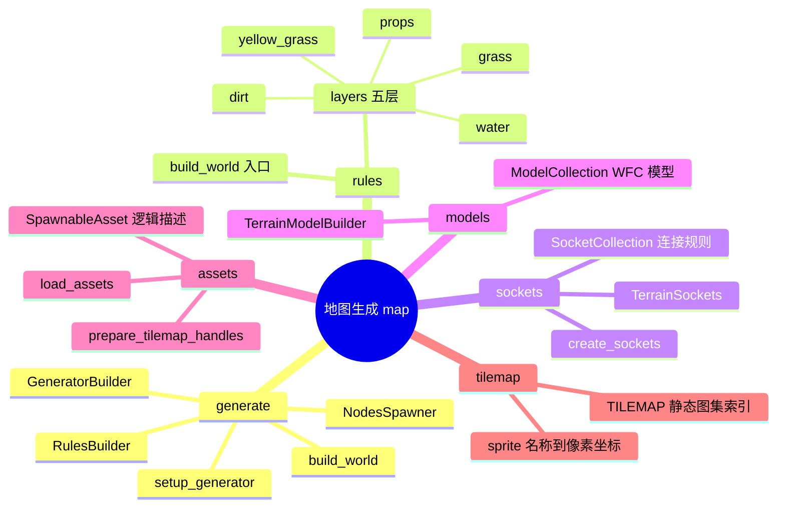
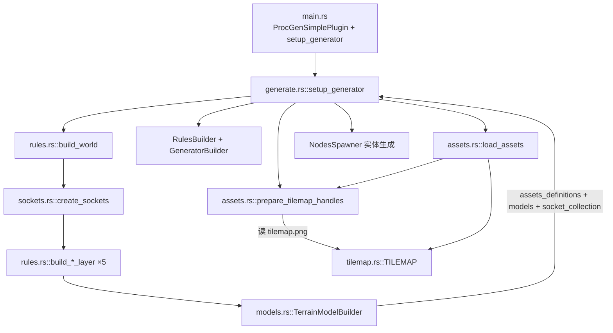
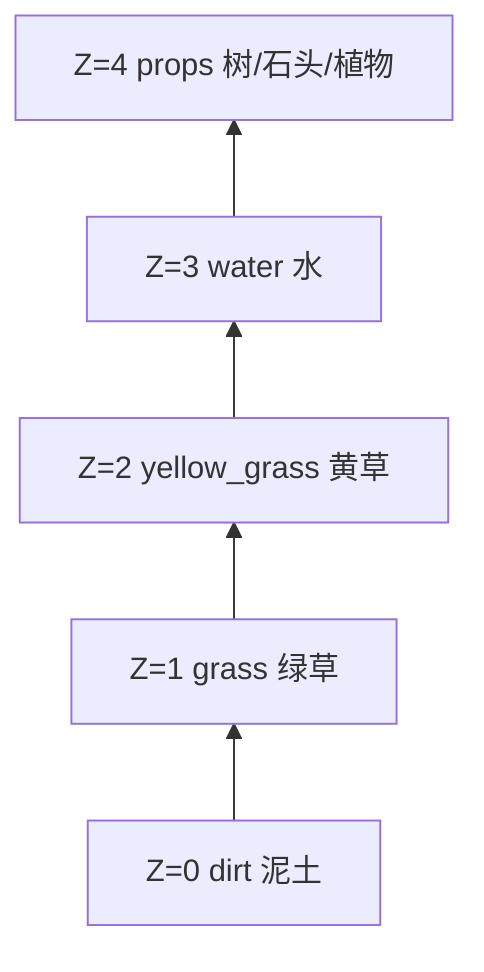
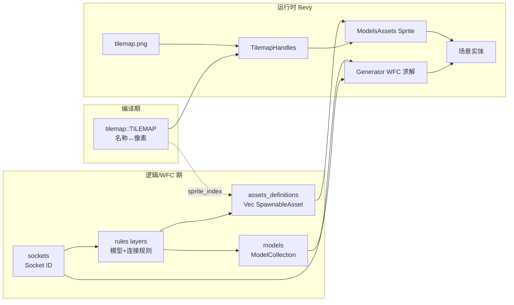

# 地图模块架构说明

本文档说明 `src/map` 下各模块的职责、关系与调用方式。工程使用 [bevy_procedural_tilemaps](https://crates.io/crates/bevy_procedural_tilemaps) 做 WFC（Wave Function Collapse）程序化地图生成。
---

## 模块一览

| 文件 | 模块 | 职责 |
| --- | --- | --- |
| `generate.rs` | 生成入口 | 组装 WFC 规则、加载图集、生成实体 |
| `rules.rs` | 规则 + 层 | 定义五层地形的模型与 socket 连接 |
| `sockets.rs` | 插槽 | 创建 `TerrainSockets` 与 `SocketCollection` |
| `models.rs` | 模型构建器 | 同步 `ModelCollection` 与资源列表下标 |
| `assets.rs` | 运行时资源 | `SpawnableAsset`、图集加载、绑定 Sprite |
| `tilemap.rs` | 静态图集表 | `TILEMAP`：sprite 名称 → 像素坐标 |

---

## 总览思维导图



---

## 调用链（从启动到渲染）



核心入口在 `src/map/generate.rs` 的 `setup_generator`：

```rust
// 1. 规则初始化：瓦片定义 + 连接规则
let (assets_definitions, models, socket_collection) = build_world();

let rules = RulesBuilder::new_cartesian_3d(models, socket_collection)
    .with_rotation_axis(Direction::ZForward)
    .build()
    .unwrap();

// 2. 网格 + 3. WFC 算法配置
let grid = CartesianGrid::new_cartesian_3d(GRID_X, GRID_Y, GRID_Z, false, false, false);
let generator = GeneratorBuilder::new()
    .with_rules(rules)
    .with_grid(grid.clone())
    // ...
    .build()
    .unwrap();

// 4. 加载图集并绑定可渲染资源
let tilemap_handles =
    prepare_tilemap_handles(&asset_server, &mut atlas_layouts, ASSETS_PATH, TILEMAP_FILE);
let models_assets = load_assets(&tilemap_handles, assets_definitions);

// 5. 生成器实体 + NodesSpawner
commands.spawn((Transform::..., grid, generator, NodesSpawner::new(models_assets, ...)));
```

`main.rs` 通过 `ProcGenSimplePlugin` 与 `Startup` 系统 `setup_generator` 启动整条链路。

---

## 各模块职责与关系

### 1. `tilemap` — 静态图集字典（最底层、无依赖）

| 内容 | 作用 |
| --- | --- |
| `TILEMAP` 常量 | 32×32 瓦片、256×320 图集尺寸 |
| `TilemapSprite` | 每个 sprite 的 **名称** + 在 `tilemap.png` 里的像素坐标 |
| `sprite_index` / `sprite_rect` | 名称 → 图集索引 / UV 矩形 |

- **不调用**其他 map 模块
- **被** `assets::load_assets` 在运行时查表

---

### 2. `assets` — 逻辑资源 ↔ Bevy 渲染资源

| 类型/函数 | 作用 |
| --- | --- |
| `SpawnableAsset` | 逻辑层：sprite 名、网格偏移、世界偏移、额外组件回调 |
| `prepare_tilemap_handles` | 加载 `tile_layers/tilemap.png`，按 `TILEMAP` 建 `TextureAtlasLayout` |
| `load_assets` | 把 `rules` 产出的 `Vec<Vec<SpawnableAsset>>` 绑成 `ModelsAssets<Sprite>` |

绑定逻辑（名称必须出现在 `TILEMAP` 里）：

```rust
let Some(atlas_index) = TILEMAP.sprite_index(sprite_name) else {
    panic!("Unknown atlas sprite '{}'", sprite_name);
};
models_assets.add(model_index, ModelAsset {
    assets_bundle: tilemap_handles.sprite(atlas_index),
    grid_offset,
    world_offset: offset,
    spawn_commands: components_spawner,
});
```

---

### 3. `sockets` — WFC 连接「插头」

| 内容 | 作用 |
| --- | --- |
| `create_sockets` | 在 `SocketCollection` 里创建一组 `Socket` ID |
| `TerrainSockets` | 按地形分层组织（dirt / grass / water / props…） |
| `layer_up` / `layer_down` / `material` 等 | 六向连接用的语义化插槽 |

**被谁用：** 仅 `rules.rs` 的各 `build_*_layer` — 定义 model 六面插槽 + `socket_collection.add_connections` 邻接规则。

---

### 4. `models` — 保证「模型」与「资源列表」下标对齐

`TerrainModelBuilder::create_model` 每调用一次：

- `ModelCollection` 多一个 WFC **模型**（拓扑 + 权重 + 旋转）
- `assets` 向量多一条 **对应的 `SpawnableAsset` 列表**

```rust
let model_ref = self.models.create(template);
self.assets.push(assets);
```

`into_parts()` 后分别交给：

- `RulesBuilder`（WFC 规则）
- `load_assets`（按 `model_index` 绑图）

---

### 5. `rules` + **layers**（五层地形规则）

`build_world()` 是唯一对外入口：

```rust
pub fn build_world() -> (
    Vec<Vec<SpawnableAsset>>,
    ModelCollection<Cartesian3D>,
    SocketCollection,
) {
    let mut socket_collection = SocketCollection::new();
    let terrain_sockets = create_sockets(&mut socket_collection);
    let mut terrain_model_builder = TerrainModelBuilder::new();

    build_dirt_layer(...);
    build_grass_layer(...);
    build_yellow_grass_layer(...);
    build_water_layer(...);
    build_props_layer(...);

    let (assets, models) = terrain_model_builder.into_parts();
    (assets, models, socket_collection)
}
```

每个 `build_*_layer` 做两件事：

1. **注册模型**：`SocketsCartesian3D` + `SpawnableAsset::new("sprite名")`（名来自 `tilemap`）
2. **注册连接**：`socket_collection.add_connections` / `add_rotated_connection`（层与层、角与边如何拼接）

**Z 轴 5 层**（`GRID_Z = 5`）与构建顺序大致对应：



层间通过 `layer_up` ↔ `layer_down` 等 socket 连接（例如 `dirt.layer_up` 接 `grass.layer_down`）。

---

## 数据流关系图



---

## 模块依赖表

| 模块 | 依赖谁 | 产出什么 | 被谁调用 |
| --- | --- | --- | --- |
| **tilemap** | 无 | 静态 sprite 表 | `assets::load_assets` |
| **sockets** | `bevy_procedural_tilemaps` | `TerrainSockets` + 填充 `SocketCollection` | `rules::build_world` |
| **models** | `assets::SpawnableAsset` | 成对的 models + assets 列表 | `rules` 各 layer |
| **rules / layers** | sockets, models, assets | WFC 规则三件套 | `generate::setup_generator` |
| **assets** | tilemap, rules 产出 | `TilemapHandles`, `ModelsAssets` | `generate::setup_generator` |
| **generate** | 以上全部 | 生成器实体 + 渲染 | `main` Startup |

---

## 设计要点

1. **WFC 只关心 sockets + models**，不关心 PNG；贴图名只在 `SpawnableAsset` 里登记，生成后再由 `load_assets` 解析。
2. **`model_index` 是胶水**：`TerrainModelBuilder` 里第 N 个 model 对应 `assets_definitions[N]`，再对应 `ModelsAssets` 里第 N 组 sprite。
3. **改美术**：动 `tilemap.rs`（坐标/名称）和 `src/assets/tile_layers/tilemap.png`。
4. **改玩法/地貌**：动 `rules` 的 layer 函数和 `sockets` 的连接规则。

---

## 常见修改场景

| 目标 | 主要改动文件 |
| --- | --- |
| 新增一种地表瓦片 | `tilemap.rs` + `tilemap.png` + 对应 `build_*_layer` + 必要时 `sockets.rs` |
| 调整草地/水面边缘拼接 | `rules.rs` 中对应 layer 的 `SocketsCartesian3D` 与 `add_connections` |
| 加大树/多格物体 | `SpawnableAsset::with_grid_offset` + props layer 模型定义 |
| 调整地图尺寸 | `generate.rs` 中 `GRID_X` / `GRID_Y` / `GRID_Z` |

---

## 相关文件路径

```
src/map/
├── mod.rs
├── generate.rs    # 入口：setup_generator
├── rules.rs       # build_world + build_*_layer
├── sockets.rs     # create_sockets, TerrainSockets
├── models.rs      # TerrainModelBuilder
├── assets.rs      # SpawnableAsset, load_assets
└── tilemap.rs     # TILEMAP 常量

src/assets/tile_layers/tilemap.png   # 图集图片（Bevy AssetPlugin 根目录为 src/assets）
```
